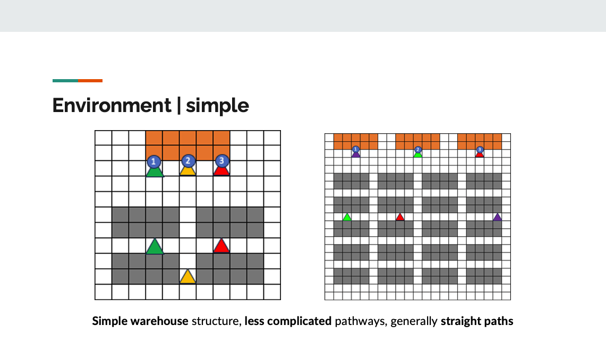
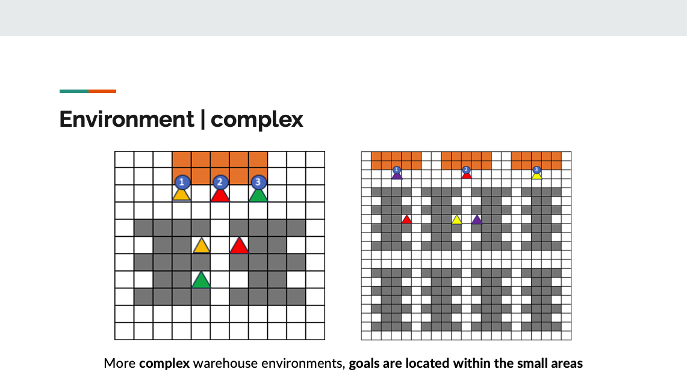
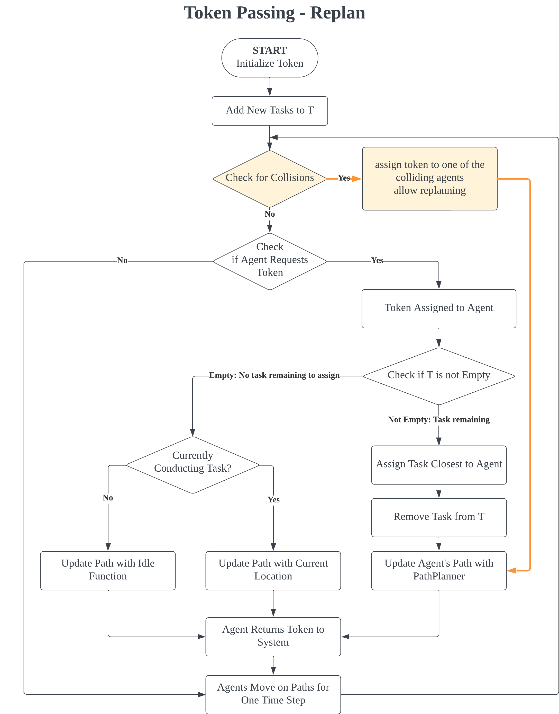
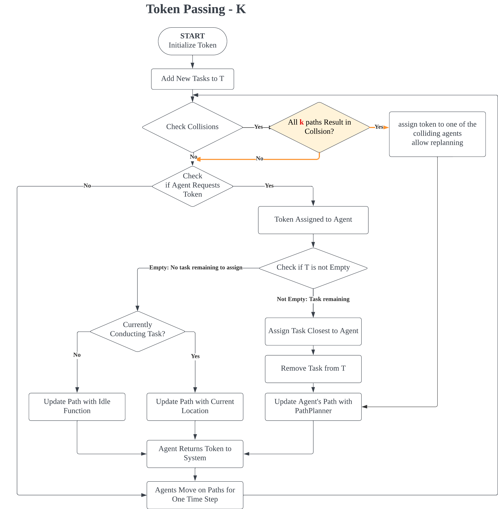
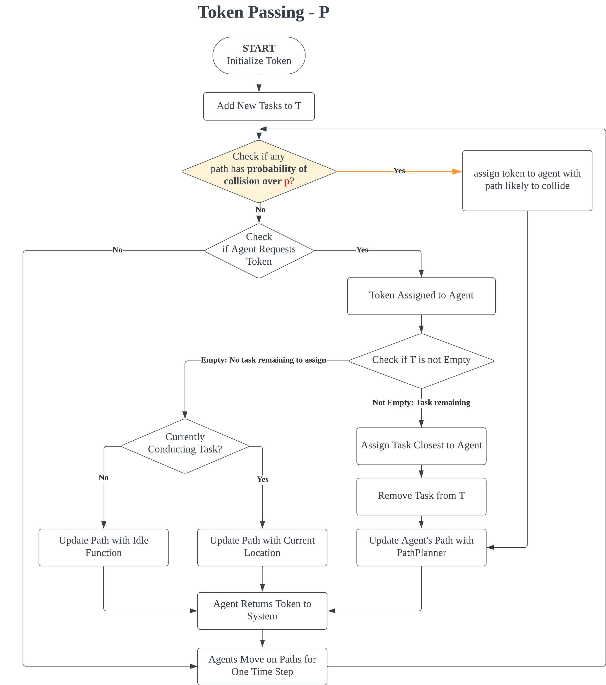
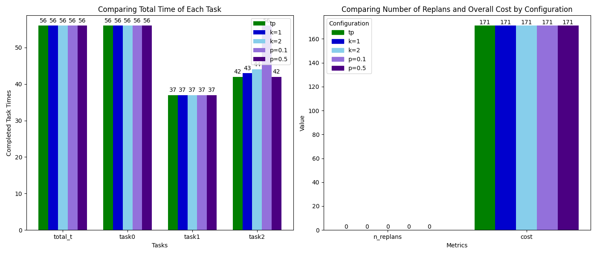
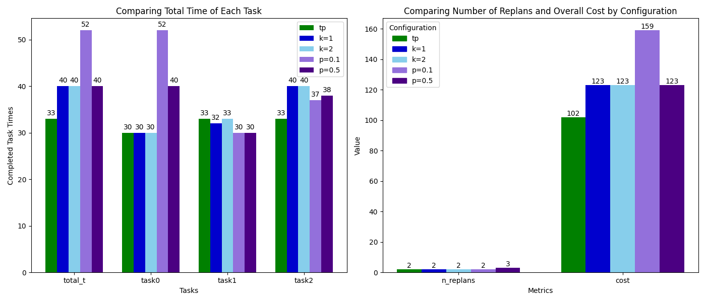
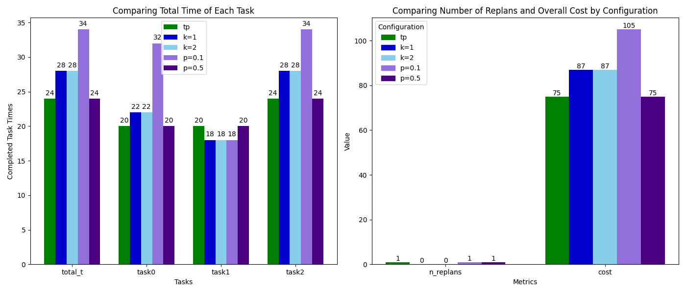
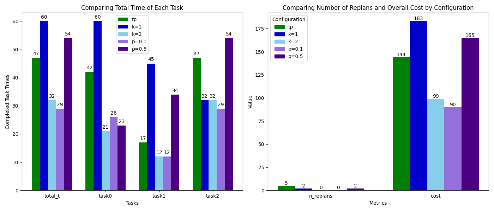

# Behavior Based Interactive Multi-Agent Robot Algorithms in Complex Environment

This project compares 3 different multi-agent robot pathfinding strategies in complex and constrained environments:
- A* with Active Behavior
- Token Passing Variants (TP-Replan, K-TP, P-TP)
- Reinforcement Learning (Q-learning)

## Motivation
Traditional centralized algorithms struggle in real-world environments with limited space, obstacles, and multiple agents. This project explores how decentralized or learning-based algorithms perform under realistic constraints.

## Implemented Algorithms

### 1. A* with Active Behavior
- Pathfinding using standard A* algorithm with assumed "goal-swapping" upon agents' collision.
- Fastest and most stable in most environments.

### 2. Token Passing Variants
- **TP-Replan**: Tokens guide task assignment; agents replan upon collision.
- **K-TP**: Multiple preplanned paths (k=2) reduce need for dynamic replanning.
- **P-TP**: Probabilistic collision avoidance (p=0.5 or 0.1).

### 3. Reinforcement Learning
- Q-Learning based agent coordination in grid environment.
- Agents learn using reward-based feedback (hit: -50, arrival: +50).
- GUI simulation using *tkinter*, with result visualization via *matplotlib*.

## Environments
Simulations were run in four types of maps:
- Simple Small Environment
- Simple Large Environment

  

- Complex Small Environment
- Complex Large Environment

  

Each map included 3 robots, 3 tasks, identical start/goal locations, and varying obstacles.

## Results Summary

| Algorithm                | Best Env.      | Avg Time | Notes                                   |
|--------------------------|----------------|----------|-----------------------------------------|
| A* with Active Behavior  | Simple Small   | Fastest  | Best in most cases                      |
| Token Passing Variants   | Varies         | Medium   | K-TP & P-TP showed slight improvements  |
| Reinforcement Learning   | Complex Small  | Slowest  | Struggled with scaling and variability  |

## Key Findings
- A* performed surprisingly well in all environments due to simplicity and efficiency.
- Reinforcement Learning required much more tuning and did not generalize well.
- Token Passing works moderately well, with minor improvements via replanning logic.

## Repository Structure
- TP_algorithms/ # Token Passing implementations
- RL/ # Reinforcement Learning code & Qtables
- A_star/ # A* algorithm with assumed active behavior
- environments/ # 4 environment maps, 2 short explanation slides for the environments
- report.pdf # Final submitted project report
- presentation.pptx # Final submitted presentation slides
- README.md

---

## Author's Contribution: TP Algorithm Implementation
*This section reflects work done by Ji Hyun Kim as part of a team project for the course “Computational Behavioral Modeling” (Fall 2023).*

The **Token Passing (TP) algorithms** in this project are adapted and implemented by *Ji Hyun Kim* based on the original open-source project:

> [Original GitHub Repository](https://github.com/Lodz97/Multi-Agent_Pickup_and_Delivery)  
> Paper: [Robust Multi-Agent Pickup and Delivery with Delays (arXiv:2303.17422)](https://arxiv.org/abs/2303.17422)

### Code Modification Highlights:
- Refactored and simplified demo structure in `demo_JH.py`
- Introduced 4 custom obstacle environments for experiments
- Set up output structure and result saving logic for consistency with report
- Created additional environment variant (`CBM_complex_big_moretask_JH.yaml`) for initial testing

### Algorithm Overview
All three Token Passing variants—**TP-Replanning**, **K-TP**, and **P-TP**—are based on a shared token communication model.  
Tokens carry information of the location, assigned tasks, and planned paths of all agents to avoid collision and optimize coordination.

| Variant      | Key Feature |
|--------------|-------------|
| **TP-Replan** | Replans paths only after collision |
| **K-TP**      | Preplans *k* alternate paths to avoid the need for replanning |
| **P-TP**      | Agents replan if predicted collision probability exceeds *p* |

<table>
  <tr>
    <td align="center">
       TP-Replan
    </td>
    <td align="center">
       K-TP
    </td>
    <td align="center">
       P-TP
    </td>
  </tr>
</table>

### Results
These algorithms were benchmarked in four custom environments, with all result logs and visualizations saved in `/final_results/`.
Below are the final performance visualizations for each of the four test environments:

  
  
  
  

---
